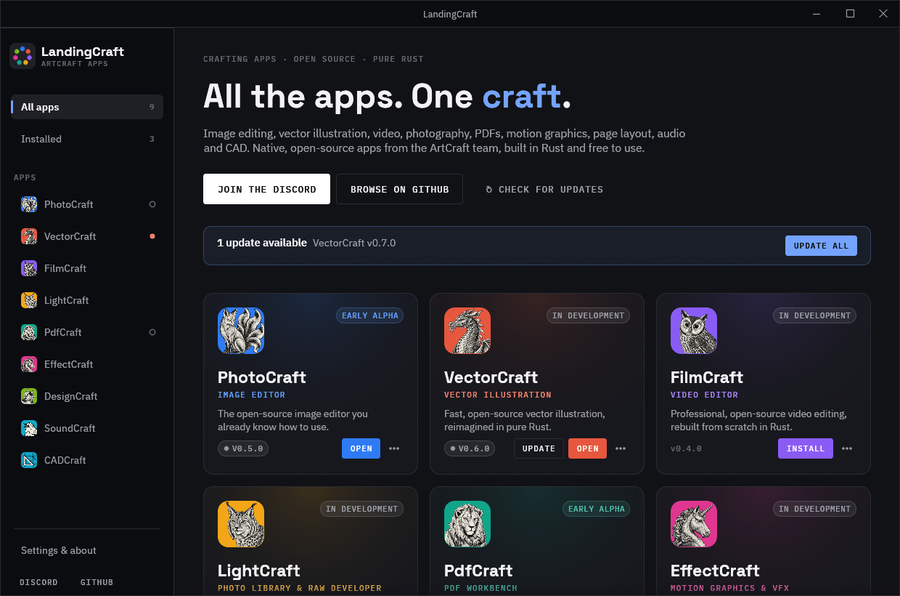
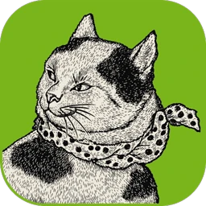
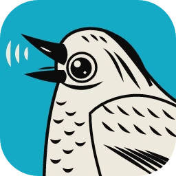
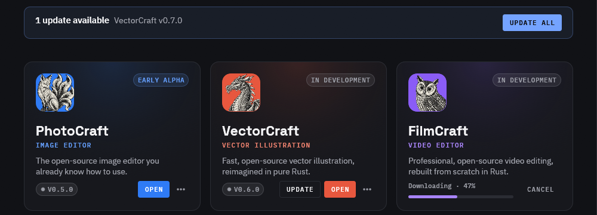
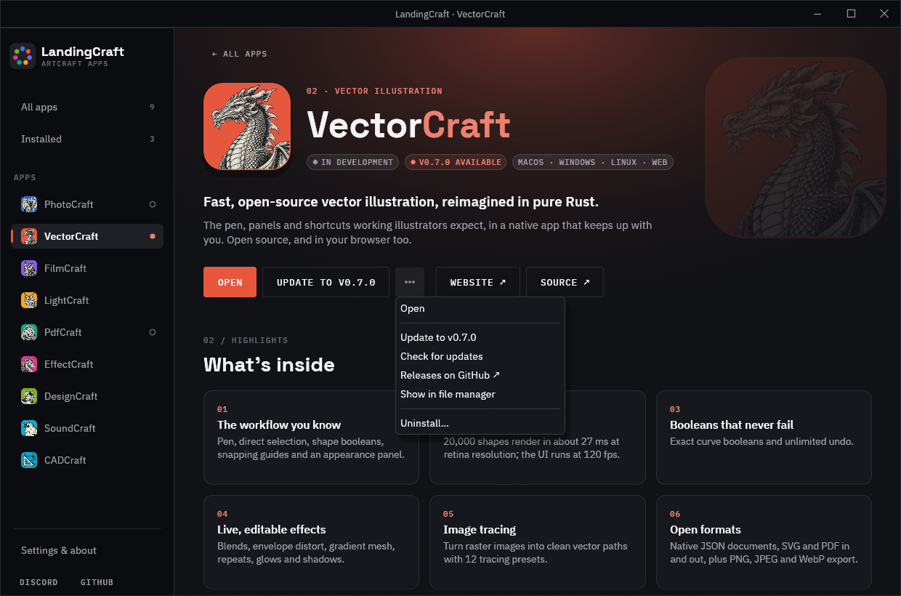
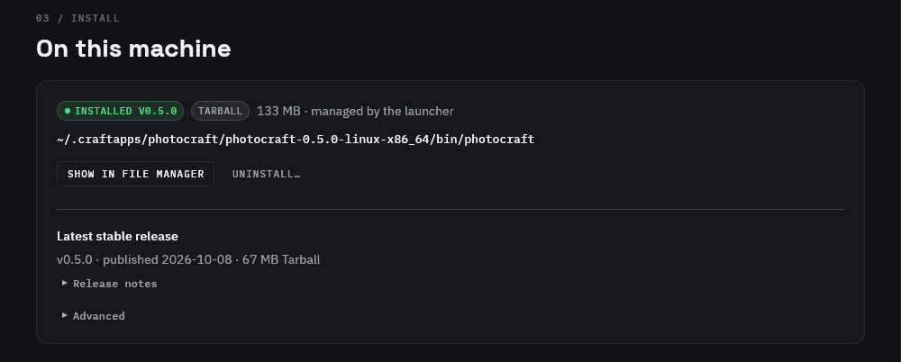
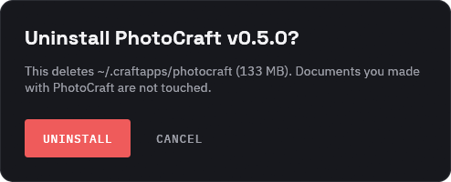
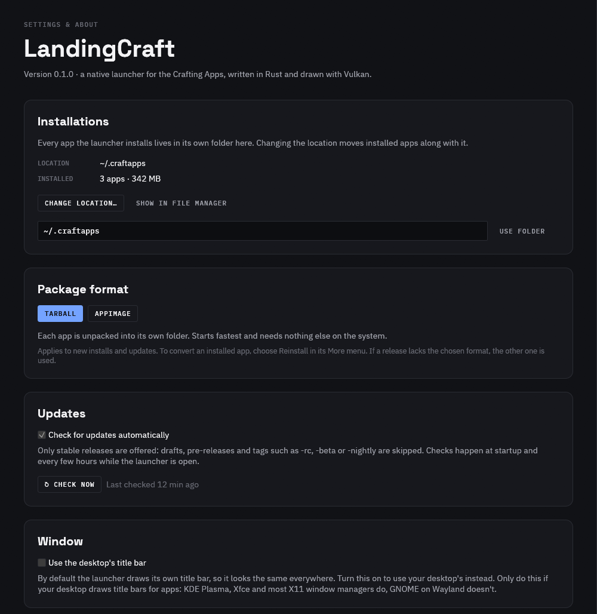
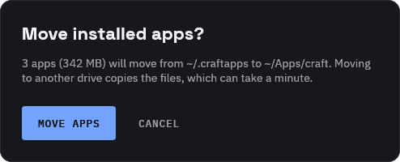

<p align="center">
  
</p>

<h1 align="center">LandingCraft</h1>

<p align="center">
  A native launcher for the <a href="https://getartcraft.com/apps">ArtCraft Crafting Apps</a>.<br>
  Install, update, open and remove every Crafting App from one window.
</p>

<p align="center">
  <b>Pure Rust</b> · <b>Vulkan</b> · <b>Linux</b> · stable releases only · checksum-verified installs
</p>



## Contents

- [The apps](#the-apps)
- [A quick tour](#a-quick-tour)
- [Settings](#settings)
- [How installs work](#how-installs-work)
- [Getting started](#getting-started)
- [Built in Rust](#built-in-rust)
- [Development](#development)
- [Credits](#credits)
- [License](#license)

## The apps

| | App | What it is |
| --- | --- | --- |
|  | **PhotoCraft** | Image editor |
|  | **VectorCraft** | Vector illustration |
|  | **FilmCraft** | Video editor |
|  | **LightCraft** | Photo library and raw developer |
|  | **PdfCraft** | PDF workbench |
|  | **EffectCraft** | Motion graphics and VFX |
|  | **DesignCraft** | Page layout and publishing |
|  | **SoundCraft** | Audio workstation |
|  | **CADCraft** | CAD and drafting |

Each app has its own accent colour, taken from its icon background. Its card, page and buttons all use it.

## A quick tour

### The library

The home screen has a card for every app. Each card shows the app's category, a one-line description,
its release stage, and either the installed version or the latest available one. The sidebar marks
installed apps with a ring, apps with an update with a coloured dot, and running apps with a pulsing
green dot. **Installed** in the sidebar shows only the apps on this machine.

### Installing and updating

**Install** downloads the newest stable release with a build for your OS and CPU. Progress shows on
the card, in the sidebar and on the app's page, and the download can be cancelled at any time. When a
newer release comes out, **Update** appears on the app, and a banner offers **Update all**.



### App pages and the More menu

Each app has a page with its summary, six highlights and supported platforms, plus links to its
website and source code. The **More (•••)** menu, on both the page and the card, holds everything else:
Update or Reinstall, Check for updates, Releases on GitHub, Show in file manager, and Uninstall.



### On this machine

The bottom of each app page shows what's installed: version, package format, disk use and
executable path. It also shows the latest stable release, with its release notes. Under **Advanced**
you can point the launcher at a copy you installed some other way, or copy the commands to build the
app from source.



### Uninstalling

Uninstall always asks first and says exactly which folder it will delete. It removes only that app's
folder in the install location, never documents you've made. An app started from the launcher can't
be uninstalled, updated or moved until you close it.



## Settings



- **Installations.** Apps install to `~/.craftapps` by default. **Change location…** opens your
  desktop's folder picker, or you can type a path. Installed apps move with the folder: renamed on the
  same drive, or copied then deleted across drives. If anything fails partway, the apps already moved
  are put back.

  

- **Package format.** **Tarball** (the default) unpacks each app into its own folder and starts fastest.
  **AppImage** keeps each app as one self-contained file, and runs it with FUSE 2 when available, or by
  unpacking first. The choice applies to new installs and updates. **Reinstall** converts an app that's
  already installed. If a release lacks the chosen format, the other one is used.
- **Updates.** The launcher checks at startup and every six hours while open, and you can turn this
  off. **Check now** runs a check straight away.
- **Window.** The launcher draws its own title bar so it looks the same on every desktop (see
  [Built in Rust](#built-in-rust)). On desktops that draw title bars for apps, such as KDE Plasma,
  Xfce and most X11 window managers, **Use the desktop's title bar** switches to the native one from the
  next start.
- **Graphics.** Shows the GPU in use and lists every Vulkan device the system offers.

## How installs work

```
~/.craftapps/
  photocraft/
    craftapp.json                      # manifest: version, format, checksum, executable
    photocraft-0.5.0-linux-x86_64/     # unpacked tarball (or a single .AppImage file)
  vectorcraft/
    ...
```

- **Stable releases only.** A release qualifies only if GitHub doesn't mark it as a draft or pre-release
  *and* its tag is a plain `X.Y.Z` version. The tag check matters: some release candidates
  (`v0.1.1-rc.5`) were published without the pre-release flag. Tags with `-rc`, `-beta`, `-nightly` or
  `+build` suffixes are always skipped.
- **Verified downloads.** Every file is checked against GitHub's SHA-256 digest for that asset, or the
  release's `SHA256SUMS.txt` for older releases. The launcher won't install a release that has no
  checksum.
- **Safe replacement.** An update is downloaded and unpacked next to the current version and swapped in
  only when complete. A failed or cancelled update leaves the working copy untouched, and interrupted
  downloads are cleaned up the next time the launcher starts. Archives may contain only files, folders
  and links that stay inside the app's own folder.
- **Movable.** Paths in each manifest are relative, so the whole install folder can be relocated.
- **Copies installed elsewhere** are still found and can be opened. The launcher looks on `$PATH` and in
  `~/.local/bin`, `~/.cargo/bin`, `~/Applications`, `~/AppImages`, `~/Downloads`, `~/bin` and `/opt`.
  Its own managed copy always takes priority.

Settings are stored in `~/.config/landingcraft/settings.json`, and the release-list cache in
`~/.cache/landingcraft/releases.json`.

## Getting started

You need Linux with a Vulkan driver for at least one GPU. To build, you also need
[Rust](https://rustup.rs). Nothing else is required, because the launcher compiles no C or C++ code.

```bash
./build.sh     # optimised release build for this CPU
./run.sh       # rebuilds if the sources changed, then launches
./install.sh   # adds LandingCraft to your application menu
```

| Script | Options |
| --- | --- |
| `build.sh` | `--portable` for a binary that runs on any x86-64 machine, `--debug` for faster compiles, `--clean` |
| `run.sh` | `--gpu NAME` to choose a GPU, `--list-gpus`, `--no-build` |
| `install.sh` | `--prefix DIR` (default `~/.local`, or `/usr/local` as root), `--uninstall` |

A few details:
- **Finding Rust:** `build.sh` finds `cargo` even when `~/.cargo/bin` isn't on your `PATH`.
- **Slow drives:** if the project lives on an NTFS, FAT, exFAT or FUSE drive, build output goes to
  `~/.cache/landingcraft/target`, because Cargo's many small files are slow on those. Setting
  `CARGO_TARGET_DIR` overrides this.
- **What `install.sh` adds:** the binary, a desktop entry (`packaging/landingcraft.desktop`) and an icon
  (`packaging/landingcraft.svg`). `--uninstall` removes just those three and leaves your installed apps
  alone.

## Built in Rust

The whole launcher is Rust, and at runtime it starts no other programs except the Crafting Apps you open.

| Area | How |
| --- | --- |
| Interface | [egui](https://github.com/emilk/egui) via eframe and winit, with fonts and icons bundled |
| Graphics | [wgpu](https://wgpu.rs) with **only the Vulkan backend** compiled in |
| GPU choice | No vendor or power class is preferred: the first hardware device the Vulkan loader lists is used. Override it with `LANDINGCRAFT_GPU=<part of name>` or `./run.sh --gpu` |
| HTTPS | [ureq](https://github.com/algesten/ureq) and rustls with the pure-Rust **RustCrypto** provider (no `ring`/`aws-lc` C or assembly), trusting your system's CA certificates |
| Archives and checksums | `flate2` (miniz_oxide), `tar`, `sha2` |
| Desktop integration | [zbus](https://github.com/dbus2/zbus) talks to the XDG Desktop Portal (opening links, folder picker) and the file manager directly over D-Bus, instead of running `xdg-open` |
| Title bar | Drawn by the launcher. winit's own Wayland title bars would run `dbus-send`, `gsettings` and `fc-match` |

The release binary links only against the standard C runtime (`libc`, `libm`, `libgcc_s`). The Vulkan
loader and the Wayland or X11 libraries are loaded from the system when the app starts.

**Note:** the RustCrypto TLS provider is still alpha software. It's the only all-Rust option today,
because the mature alternatives include C and assembly.

## Development

```bash
cargo test
```

The end-to-end installer test downloads about 120 MB from GitHub. It cancels a first install, installs
PdfCraft as a tarball, converts it to an AppImage, moves it to another folder, then uninstalls it. Run
it on request:

```bash
LC_TEST_DIR=/tmp/lc-test cargo test --release -- --ignored --nocapture
```

The screenshots in this README come from the optional `screenshot` feature. The launcher saves an image
of its own window, so nothing else on screen is ever captured:

```bash
cargo build --features screenshot
LANDINGCRAFT_SCREENSHOT=out.png LANDINGCRAFT_DEMO=menu:vectorcraft target/debug/landingcraft
```

### Source layout

| Path | Purpose |
| --- | --- |
| `src/catalog.rs` | App data: names, summaries, highlights, accents |
| `src/app.rs` | Launcher state and actions: install, update, uninstall, move |
| `src/app/` | Pages and dialogs: library, app page, settings, title bar, shared widgets |
| `src/releases.rs` | GitHub release lookup, stable filtering, choosing the right file |
| `src/installer.rs` | Download, verify, unpack, swap in, uninstall, move installs |
| `src/settings.rs` | Install folder, package format and other settings |
| `src/theme.rs` | Colours, fonts and the custom-painted buttons, pills and glows |
| `src/detect.rs` | Finding copies installed elsewhere, and launching apps |
| `src/gpu.rs` | Vulkan-only wgpu setup and GPU selection |
| `src/portal.rs` | Desktop portal and file manager over D-Bus |
| `src/screenshot.rs` | The development-only screenshot feature |
| `packaging/` | Desktop entry and app icon |
| `docs/screenshots/` | Images used in this README |

## Credits

- **Apps:** names, descriptions and icons belong to the ArtCraft team. See
  [getartcraft.com/apps](https://getartcraft.com/apps) and [github.com/storytold](https://github.com/storytold).
- **Fonts:** [Space Grotesk](https://github.com/floriankarsten/space-grotesk) and
  [IBM Plex](https://github.com/IBM/plex), both under the SIL Open Font License 1.1
  (see [`assets/fonts/OFL.txt`](assets/fonts/OFL.txt)).

## License

LandingCraft's own code and files are dedicated to the public domain under
[CC0 1.0 Universal](LICENSE). You can copy, modify and distribute them, even commercially, without
asking permission.

That dedication doesn't cover material by others included in this repository:

- **The Crafting Apps' names, descriptions and icons** (`assets/icons/`, and as they appear in
  `docs/screenshots/`) belong to the ArtCraft team.
- **The bundled fonts** (`assets/fonts/`) remain under the SIL Open Font License 1.1.
